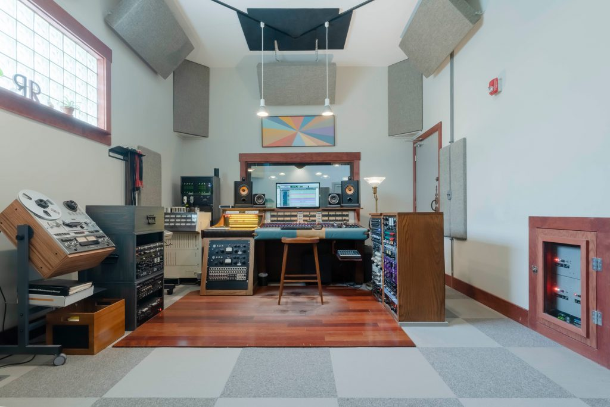

Builds upon Audio Production I. Course focus is on multi-track recording, production, mixing, and editing in professional software applications. Other topics taught include mixing console management, signal processing, ear training, advanced audio for video editing, and live sound production techniques.
