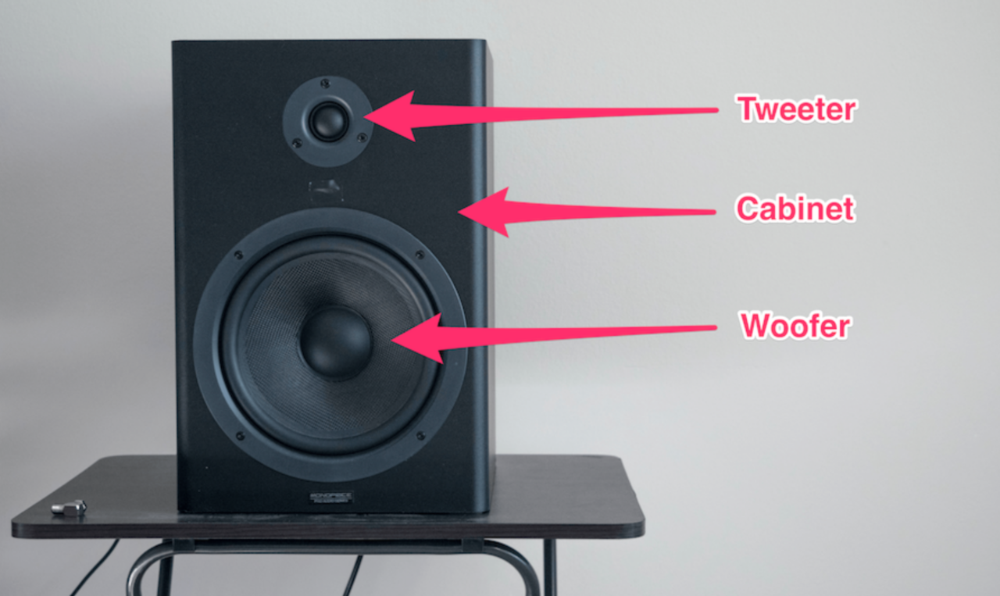
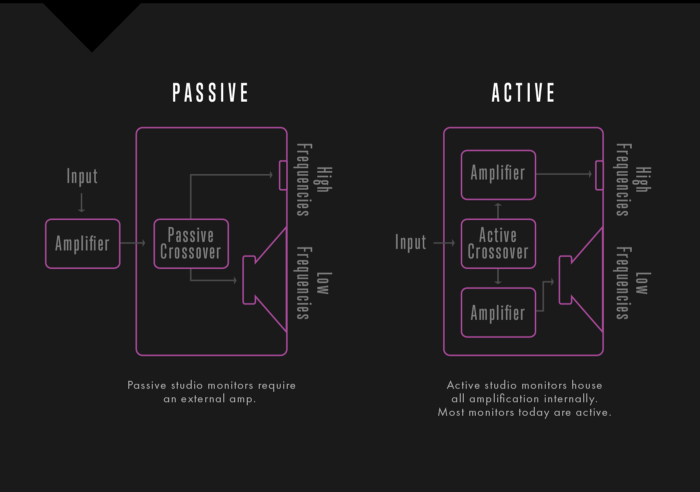
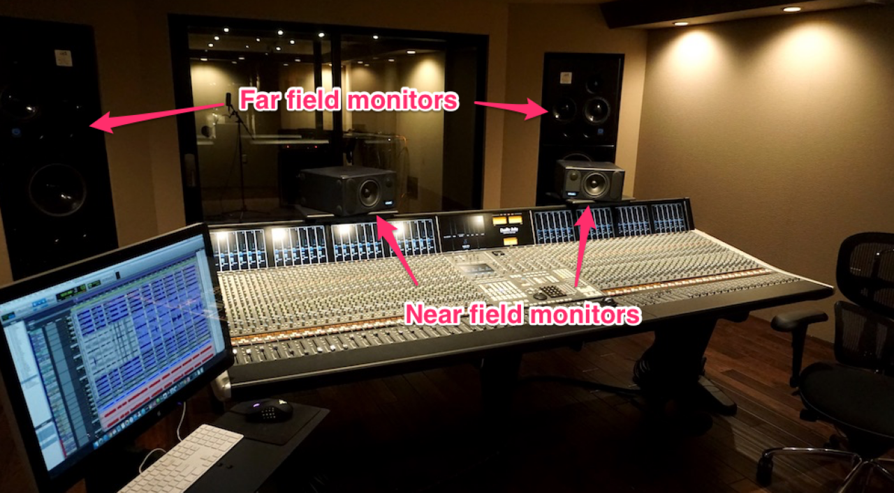
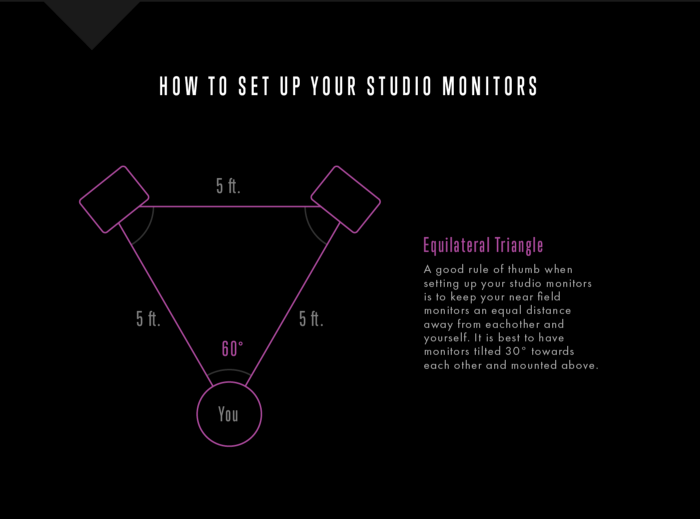

+++
title = "Monitoring"
outputs = ["Reveal"]
[reveal_hugo]
custom_theme = "reveal-hugo/themes/sunblind.css"
margin = 0.2
+++

<!-- show_notes = "separate-page" -->

## The Importance of Hearing and Listening in Audio Mixing

- Understanding the critical role of reliable hearing in audio mixing
- Navigating the challenges of mixing in less-than-ideal environments
- Learning to make objective decisions based on what you hear
- The common misconception about processing techniques

{}

- Reliable hearing is essential for audio mixing. Without accurate auditory feedback, efforts in mixing can be counterproductive, leading to mixes that don't translate well across different playback systems.
- Professional engineers often have access to high-end equipment and acoustically treated spaces, but many also excel in less ideal conditions. Adopting their tactics can be beneficial even in small, less equipped studios.
- The ability to make objective decisions about audio, such as EQ adjustments or vocal clarity, is crucial. This skill goes beyond the capabilities of the equipment used.
- Many who struggle with their mixes believe their techniques are at fault. However, the root issue often lies in not being able to accurately hear or interpret what is being heard.

{}

---

## Ideal environments - Famous studios around the world

- Hans Zimmer's Music Lair
  - [(41) Look Inside Hans Zimmer's LA Studio — Hans Zimmer Strings - YouTube](https://www.youtube.com/watch?v=dFcvQY3U6XA)
  - [14th Street Music](https://14thstreetmusic.com/)
- [Electric Lady Studios](https://electricladystudios.com/)
- [Real World Studios](https://www.realworldstudios.com/)
- [Abbey Road Studios](https://www.abbeyroad.com/)
- [Blackbird Studio](https://www.blackbirdstudio.com/)
- [Ocean Sound](https://www.oceansound.no/)

{}

Here are some of the ideal environments I mentioned before. 
{}

---

## Real-world studios

<iframe width="560" height="315" src="https://www.youtube.com/embed/O1YYbaLQN0Y" title="YouTube video player" frameborder="0" allow="accelerometer; autoplay; clipboard-write; encrypted-media; gyroscope; picture-in-picture" allowfullscreen></iframe>

---

## Selecting the Right Monitoring Equipment for Audio Mixing

- Choosing appropriate monitoring equipment
- Maximizing value for money in monitor selection
- Understanding the limitations of hi-fi speakers for studio use
- Personal preference in monitor choice

{}

- Choosing the right equipment for monitoring is crucial as it provides the primary feedback for all mixing decisions. Quality monitoring systems, which offer a clear and even frequency response, are often expensive but vital for accurate audio representation.
- Volume isn't as critical as audio quality in studio monitors. Famous mix engineers often prefer smaller, nearfield monitors for a more accurate sound, rather than large, powerful speakers.
- For small studios, it's advisable to focus on achieving high-quality stereo sound rather than investing in a complex surround setup, especially when working with a limited budget.
- Hi-fi speakers, designed to enhance audio, aren't ideal for studio work where identifying flaws in a mix is essential. Active or powered speakers are a better choice due to their convenience and built-in amplification tailored to the speaker's design.
- Monitor choice is subjective, and getting accustomed to the specific sound of your chosen monitors is part of the learning process. Familiarity with your monitors, aided by reference recordings, is key to effective mixing.

{}

---

## Studio Monitors

{}

- cabinet - what surrounds the speaker electronics, can be made out of various materials, like metal, wood, or plastic.
- two drivers
  - tweeter - Tweeters are often cone- or dome-shaped, again constructed from a wide range of materials. They are responsible for producing high frequencies, usually starting at around 2 kHz.
  - woofer - These are generally cone-shaped and responsible for producing low and mid-range frequencies in monitors with two drivers (called two-way).

{}

---

## Active vs Passive

{}

- passive - requires an external amplifier to amplify the input signal before entering the monitor. This amplified signal is then sent through a series of electronic components within the monitor called the crossover network.
- active - does not require external amplification, as amplifiers are housed within the cabinet. The input signal entering the monitor passes through the crossover network first, after which each band is separately amplified before being sent to the relevant drivers.
- Active speakers are much more convenient to use, as they require no external equipment to be used.

{}

---

## Nearfield monitoring

{}

- Our monitors can be the most important part of our mix environment. They are something that it makes sense to spend a bit of money on.
- generally have smaller drivers and are placed closer to the listener (around 2-3 feet away). Their proximity means that more direct sound from the monitor will hit the listener’s ears, rather than reflected sound from surfaces in the room. Near fields will seem to increase the ratio of direct to reflected sound.

{}

---

## What are the mains for?

> “There just aren’t many situations where the main monitors sound all that good,” says Chuck Ainlay. “The mains in most studios are intended primarily for hyping the clients and playing real loud.”

> “I don’t use the big monitors in studios for anything,” says Nigel Godrich, “because they don’t really relate to anything.”

---

## Which monitors to pick?

- [ADAM Audio T5V 5 inch Powered Studio Monitor](https://www.sweetwater.com/store/detail/T5V--adam-audio-t5v-5-inch-powered-studio-monitor)
- [KRK ROKIT 8 G4 8 inch Powered Studio Monitor](https://www.sweetwater.com/store/detail/Rokit8G4--krk-rokit-8-g4-8-inch-powered-studio-monitor)
- [Behringer Truth B2031A 8.75 inch Powered Studio Monitor](https://www.sweetwater.com/store/detail/B2031A--behringer-truth-b2031a-8.75-inch-powered-studio-monitor)
- [Yamaha HS8 8-inch Powered Studio Monitor Pair - Black](https://www.sweetwater.com/store/detail/HS8pr--yamaha-hs8-8-inch-powered-studio-monitor-pair-black)
- Other [suggestions](https://cambridge-mt.com/ms/ch1/) from the book

{}

- It's also a good idea to avoid "hi-fi" speakers, such as those used in home stereo systems.
- active are good
- a lot of it is budget and personal preference

{}

---

## Speaker stands and other mounts

- [Stand recommendations](https://ehomerecordingstudio.com/studio-monitor-stands/)
- [IsoAcoustics](https://www.sweetwater.com/store/detail/ISO155--isoacoustics-iso-155-isolation-stands-for-studio-monitors-pair)
- [Auralex MoPAD Monitor Speaker Isolation Pads](https://www.sweetwater.com/store/detail/MoPAD--auralex-mopad-monitor-speaker-isolation-pads)



- the speaker cabinets should be as firmly fixed as possible, because if they move at all in sympathy with the woofer excursions it’ll mess with how the low end of the mix is represented. How exactly you decide to mount the boxes will depend on the physical limitations you have to work with in your particular setup, but my recommendation is to use dedicated speaker stands, as these typically give a much better sound than desks and shelves and can be moved around the room more easily than heavy-duty wall brackets.



---

## Critical Speaker Positioning for Optimal Audio Mixing

- Importance of direct speaker alignment to the listening position
- The phenomenon of phase and comb filtering in audio
- Vertical alignment and its impact on audio quality
- Comb filtering between speaker drivers in nearfield monitors

{}

- Precise speaker positioning is essential. Speakers should be aimed directly at the listening position to ensure accurate high-frequency reproduction, as high frequencies are more directional and can be obscured by obstacles.
- Phase and comb filtering significantly affect audio quality. When two identical audio signals are slightly out of alignment, phase cancellation occurs, altering the sound's tonality. This effect is especially pronounced with complex, real-world sounds like music.
- Vertical alignment of speakers is crucial due to the waveguide effect and the positioning of multiple drivers in nearfield monitors. Misalignment can result in comb filtering, particularly around crossover frequencies, affecting mid-range frequencies.
- Comb filtering is a critical issue in two-driver nearfield monitors. Misalignments between the woofer and tweeter can cause frequency cancellations in the sensitive mid-frequency range, impacting critical sound elements like vocals and snare drums.

{}

---

## How to set up the monitors?



Here's a helpful diagram. 


