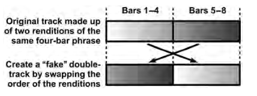
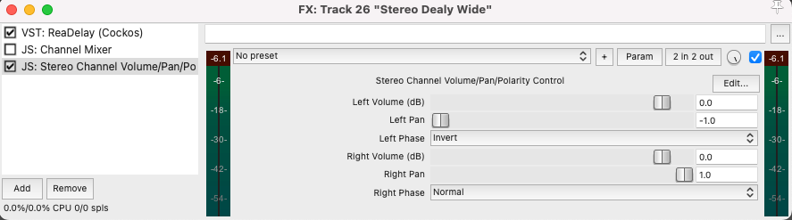

Mike Senior listening examples: [Chapter 18: Stereo Enhancements](https://cambridge-mt.com/ms/ch18/)

> “Modern mixing is all about being wide,” says Delbert Bowers, “with different styles requiring different types of width.”

## Arrangement Tweaks

One way to generate width without even using plugins is to create a fake double-track. It's best to do this by taking a section that repeats and using the repeated version of the section as the double track, so that your double isn't exactly the same.

Andy Wallace talks about using this technique regularly:

> “Normally I like to create [double-tracks] from the performances that are already there by taking the double from another moment in the song where the part is played, so I actually really get two different performances.”

Remember that if you just try to duplicate the same track it will cause serious phase cancellation issues in mono, and just not sound as interesting.

If you do need to use the same track, try to apply some sort of different processing settings to the double, so that it's not phase coherent.

Mike Senior also suggests using adding a wide synth pad or noise texture (tape hiss, vinyl noise, and Foley room tones).

> A pad will enrich pitched sustains, unpitched textures will to some extent improve perceived blend and obscure low-level details, and Foley ambiences may also clearly imply a sense of size and space.

## Adjusting Stereo Spread

With stereo recordings, narrowing tracks is simple. The difficulty comes when one wants to _widen a stereo track._ We can have greater control over the width of stereo tracks using MS encoding.

From the book:

> one channel containing the mono elements at the center of the stereo image (the Middle signal) and one channel containing the elements that appear off-center (the Sides signal). As a sound moves off-center in a Middle and Sides (MS) recording, its level reduces in the Middle signal and increases in the Sides signal, its polarity in the Sides signal indicating which side of the stereo field it happens to be on. You can represent an identical stereo signal in both left–right and MS formats, and because each represents exactly the same information it’s easy to convert between them.

- An MS encoding plugin will give you the ability to adjust the stereo width by changing the level of the Sides signal.
- You can also use these plugins to reduce the level of the center, leaving space there for more important elements.

Other stereo tools:

- [Affordable Middle & Sides (MS) Plug-ins](https://cambridge-mt.com/ms/ch18/)

## Static Enhancements

MS processing can only alter what's already there. But, what about _widening mono tracks_?

### EQ based widening

- duplicate your mono track;
- pan the original and duplicate tracks to opposite sides of the stereo image;
- insert an equalizer into the original channel and make any old selection of cuts and boosts;
- copy that equalizer setting to the duplicate channel, but with the gain settings of the equalizer inverted so that cuts become boosts, and boosts become cuts.

> An EQ setting with lots of small peaks and troughs usually creates a more even feeling of frequency spread, which is why this technique is often associated with graphic EQ

> Nonetheless, I’ve never had particularly good results with basic EQ-based widening for important music parts, because of the way it destabilizes the phantom image and seems to make instruments sound less solid in the mix. Better to save it for incidental parts that suit a more diffuse and background role.
>
> -- Mike Senior

### Comb Filtering

Comb filtering is similar to the previous method, and better for general purpose uses. Comb filtering will create more peaks and troughs than possible with an EQ plug-in.

- Stereo delay send - 20ms delay time
- no feedback
- invert the polarity of the return signal’s left channel only

### Haas Delays

Pan a delayed echo of the signal about 30 ms.

> For the widest stereo effect, you should pan the wet
> and dry sounds to opposite stereo extremes, but I find
> that most of the best applications for this Haas delay effect
> are where the wet and dry signals aren’t pushed that far apart.

### Pitch Shifting

- duplicate a track and pan hard left and right
- apply +5/-5 cents pitch shifting to each track
- ReaPitch can do this without track duplication
- A variation: Put an LFO on the pitch shift amount for some interesting movement

## Modulated Enhancements

### Auto-panning and Rotary Speaker Emulation

- [Cableguys | PanCake](https://www.cableguys.com/pancake.html)
- [MAutopan | MeldaProduction](https://www.meldaproduction.com/MAutopan)
- [Rob Papen RP-PAN (Pan tool, Panning Modulator, Stereo Tool)](https://www.audiopluginsforfree.com/rob-papen-rp-pan/)
- PanMan - Soundtoys

### Dynamic Tone and Pitch Changes

Modulated tonal changes may provide a more useable stereo enhancement than the static EQ trick we used earlier.

You can try the following as send effects to modulate the left and right channels of a

- Chorusing,
- flanging,
- and phasing

Andy Wallace likes this kind of treatment on bass:

> “Not so much as ‘Dig the flange on the bass!’, because I kind of prefer that nobody even knows it’s there. . . . I use that just to open things up a little bit so that everything is not kick, snare, bass right down the middle. Not that there’s anything wrong with that, but sometimes it feels sonically a little more interesting to me.”

Adam Moseley does something similar, but for different reasons:

> “Sometimes the emotional point of the song will be the warmth of it, and you need to have this surrounding warmth come out of the speakers when the first bass note happens. I want it to sound like it’s just come out and put its arms around you, like it’s warm water, or your parent with a warm towel. So even if it was a mono bass . . . I’ll put it into some kind of stereo thing.”

Freeware with l/r out of phase options:

- [Blue Cat's Flanger](https://www.bluecataudio.com/Products/Product_Flanger/) + phaser + chorus
  - or get the bundle: [Blue Cat's Freeware Plug-ins Pack II](https://www.bluecataudio.com/Products/Bundle_FreewarePack/)
- [GVST - GChorus](https://www.gvst.co.uk/gchorus.htm)

## Stereo Enhancement plugins

- [Wider | Polyverse Music](https://polyversemusic.com/products/wider/)
- [Stereo Touch - Voxengo](https://www.voxengo.com/product/stereotouch/)
