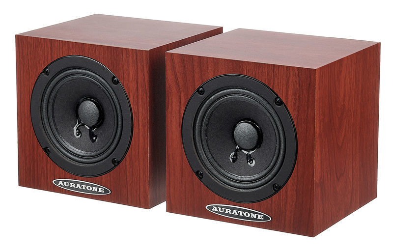
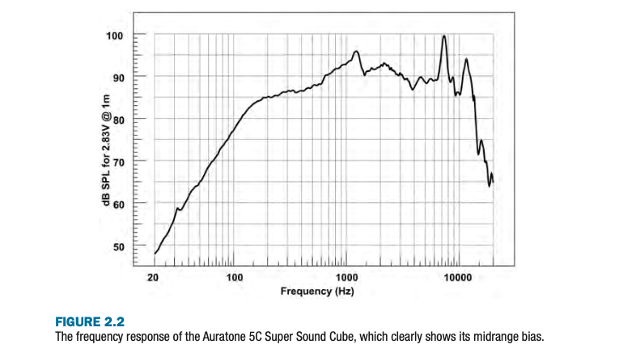

+++
title = "Supplemental Monitoring"
outputs = ["Reveal"]
[reveal_hugo]
custom_theme = "reveal-hugo/themes/sunblind.css"
margin = 0.2
+++

## Phantom Image

- It doesn't sound the same as point sources from single speakers
- use StereoTest as demo
- Madonna's "American Life" - at 45 seconds we hear a hard panned acoustic guitar, then 15 seconds later a hard panned synth. They sound more present than the vocals.

---

## Real-world playback systems

- Monitors don't sound like what we listen to music on for fun
- they're good at:
  - for investigating what’s going on across the whole frequency spectrum, especially at the frequency extremes;
  - for judging the impact of mix processing on the sheer quality of your sounds;
  - for evaluating and adjusting the stereo image;
  - for understanding how your mix will sound on more high-fidelity listening
    systems;
  - for impressing the pants off the artist, client, or anyone else in the room
    with you!


Because of this other monitoring solutions can be better than nearfield monitors. We still need the nearfields to create a baseline but its equally as important to check mixes in real-world situations.


---

## Auratone 5C Super Sound Cube

{}

- Used on Adele’s 21, Dire Straits’s Brothers In Arms, and Michael Jackson’s Thriller,
- The problem is that they're not manufactured anymore, so how can we use their qualities?

{}

---

## Quotes

> “I love Auratones!” enthuses Jackson’s long time producer and engineer Bruce Swedien. “You know what Quincy [Jones] calls them? The Truth Speakers! There’s no hype with an Auratone. . . . Probably 80 percent of the mix is done on Auratones, and then I’ll have a final listen or two on the big speakers.”

---

Tom Elmhirst on working with Adele:

> “When I mix I’ll be jumping around for the first couple of hours playing the track loudly via my [nearfields], and once I know the bottom end is rocking, I’ll mix with low volume on the Auratones for the rest of the day. If I can make a mix work on the Auratones, I know I’m flying.

---

## Midrange focus

- portless
- single, small driver focuses us to the midrange

> “The real perspective lives in that range,” says Jack Joseph Puig. “It doesn’t live in the highs, it doesn’t live in the lows. That’s what really speaks to the heart.”

{}

- This is the range that is most likely to reach your listeners ears
- This is the most common range to the most common listening devices
- if you list all the devices most of them are only producing midrange
- mobile devices, clock radios, and a lot of TVs, music-player docking stations, and portable wireless speakers

{}

---

---

## Mono compatibility

- we can listen to just one to check hwo it would sound without stereo imaging
- most listening environments won't have sweet spots that people sit in regularly
- or acoustic treatment etc
- headphones are the best place to experience stereo

{}
Many other systems don’t even make a token stab at stereo! Things such as telephone hold systems, band/ club PAs, and shopping-center announcement systems all typically sum their inputs to mono before feeding any speakers. FM radio receivers also often automatically sum the audio to mono in order to improve reception in the presence of a weak transmitted signal.

So, we should always check mixes in real-world situations, with speakers that produce the range of frequencies and without stereo imaging.

{}

---

## Auratone substitutes??

- We have the [Behritone](https://www.behringer.com/product.html;jsessionid=EE0AAD9D1FF08794D2BD596CF6DB6EBA?modelCode=P0A9N)
- It's speaker C, you need to sum to mono first before listening
- lets do some comparisons to the farfields

---

## Headphones

- perhaps the most common listening device currently
- The stereo image will sound different on headphones than on speakers
- they also block out background noise so can be useful for doing detailed listening
- also easier to hear bad edits, clipping, pops etc
- its good to have a pair that you are familiar with the sound of

{}
What’s more important about headphones is that almost all of them transmit each side of your mix exclusively to one ear, whereas with speakers the two stereo channels are always heard to some extent by both ears. For this reason the stereo image is much wider on headphones (the image encompass- ing an angle of 180 degrees, where speakers only cover around 60 degrees), and any sound at the stereo extremes feels disconnected from the rest of the mix as a result.

{}
