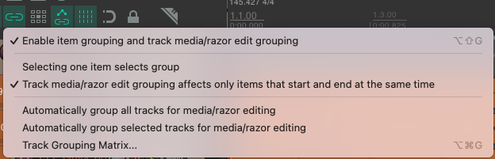

## Step-by-Step Guide for Drum Editing

### Using Stretch Markers

We're going to use the snare and kick drum as guides to add stretch markers to our project. We'll then use these stretch markers to quantize the drums to the grid.

#### Preparing the Project

- **Group Items**: Group all drum items together. This allows you to edit one track and simultaneously apply changes to all grouped tracks.
- Turn off this setting: 
  - 

#### Creating a Duplicate Project
- **Duplicate Project**: Copy the current project to create an identical one. This will be used for editing drums without stretch markers.

####  Adding Stretch Markers to Snare Track
- **Select Snare Track**: Focus on the snare track within your project.
- Open the dynamic split dialogue with the shortcut "D". Use the following settings: 
  - 
- **Add Stretch Markers**: Use the action "Add stretch markers to selected items and grouped items" to add stretch markers to the transients on the snare track.
- Do the same process to one of the kick tracks. 

####  Ensuring All Hits Have Stretch Markers
- **Inspect the Song**: Go through the entire song and check for any kick or snare hits that are missing stretch markers.
- **Manual Addition**: If any hits are missing markers, add them manually in Reaper using "shift + w".

#### Adjusting Drum Hits
- **Enable Snapping**: Turn on the snapping feature and set the grid snap spacing as needed.
- **Manual Adjustment**: Manually adjust drum hits to align with the grid. This is useful for changing a few drum hits.

#### Quantizing Using Stretch Markers
- **Apply Quantization**: Right-click on a kick track and navigate to stretch markers -> stretch markers in selected items -> snap to grid.
- **Check for Glitches**: Listen to the track for any glitches introduced by this process.
- **Remove Problematic Stretch Markers**: Use "option + click" to delete stretch markers causing glitches. Repeat until all glitches are removed. This part is really important to ensure that the song doesn't sound too robotic.

### Without Using Stretch Markers

####  Initial Preparation
- **Group Drums**: Ensure your drums are grouped for simultaneous editing.
- **Enable Necessary Options**: In the options menu, select:
  - Auto-crossfade media items when editing
  - Trim content behind media items when editing

#### Splitting Drum Tracks
- **Split Snare Track**: Use "Dynamic split items" on the snare track. Ensure you choose "split selected and grouped items" to apply the split to all drum tracks based on the snare. Make sure the leading and trailing pads are set to 0.
- **Repeat for Kick Track**: Follow the same process for the kick track.
- Before moving onto the next step, make sure all of your splits are actually on a transient. If you don't do this the quantization will not work properly.
- You'll want to temporarily disable snapping to move the splits by holding down the **shift key**.

####  Quantizing Drum Group
- **Quantize to Grid**: Go to item -> item processing -> quantize item positions to the grid. Ensure "move group items with selected items" is selected.
- **Adjust Settings**: If the result sounds off, quantize again but enable "extend start items to overlap with earlier items" and "shorten earlier items if quantized items overlap by more than", setting both to 3 ms.

####  Managing Crossfades
- **Inspect Crossfades**: Check that crossfades are not obscuring the transients of your snare or kick. Use "command + ]" to move to each crossfade.
- **Adjust Crossfades**: If a crossfade is out of place, move it using the shift key.

####  Comparing Techniques
- After correcting glitches, compare the results from the stretch marker method and the non-stretch marker method. Determine which technique provides better results for these drums.

<!-- ## With stretch markers

We'll be using the Hurray For the Riff Raff's _Living in the City_ tracks to learn drum editing. So, make sure you have those loaded up.

Next, group all of the items together so that editing one track will edit all of them. Copy this project to create an identical project to edit the drums without using stretch markers. It's important to know how to do it with and without stretch markers.

Add stretch markers to the transients of the snare track. Make sure you select the action "Add stretch markers to selected items and grouped items."

Next, duplicate the kick track and add transients to the duplicated kick track. You have to do this or it will delete your stretch markers from the snare track. Now you can delete the copied kick track. You should now have stretch markers on all your tracks for the kick and snare.

Go through the song and check to see if there are any kick or snare hits that do not have stretch markers on them. You can add them manually in Reaper using "shift + w".

We can now manually adust drum hits to the grid. To do this make sure snapping is on and set the grid snap spacing to what you need. Experiment with this to see how it works. This is good if you only want to change a few drum hits. But there's a quicker way.

Right click on a kick track, stretch markers -> stretch markers in selected items -> snap to grid. Now listen for any glitches that this technique may have introduced. It uses stretching so there might be some. This will happen when it tries to quantize rhythms that are shorter than your snap settings. If you find problems delete the stretch markers using "option + click". Continue until you've removed all the glitches from the song.

## Without stretch markers

This method doesn't require time stretching, so can be better in some circumstances.

Make sure your drums are grouped so we can edit them at the same time. Next, make sure these options are selected in the options menu:

- Auto-crossfade media items when editing
- Trim content behind media items when editing

We'll first split up the snare track. Split it by its transients using "Dynamic split items". If you "split selected and grouped items" then all of your drums will be split based on the snare. Now do the same process to the snare.

Now quantize your drum group to the grid by going to item -> item processing -> quantize item positions to the grid. Make sure "move group items with selected items" is selected. Listen to the results. It will probably sound bad. Quantize again but select "extend start items to overlap with earlier items" and "shorten earlier items if quantized items overlap by more than" and set them both to 3 ms.

Go through and check that your crossfades aren't covering up the transients of your snare or snare. Move to each crossfade with "command + ]". If you find a crossfade that's out of place you can move it with the shift key.

After you're done fixed the glitches compare the results you got with this method to the stretch method. Which techniques gives better results for these drums? -->
