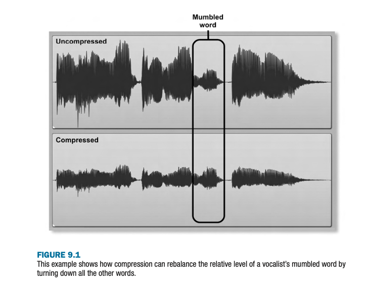

+++
title = "Compression"
outputs = ["Reveal"]
[reveal_hugo]
custom_theme = "reveal-hugo/themes/sunblind.css"
margin = 0.2
+++

## Understanding Compression in Mixing

- Compression as an automated fader
- Reducing undesirable signal-level variations
- Example: Correcting vocal level inconsistencies
- Compressors' role in achieving a balanced mix

{}

- Compression in mixing can be likened to an automated fader, adjusting audio levels in real time to maintain balance.
- It addresses issues like fluctuating signal levels, ensuring instruments and vocals retain their place in the mix.
- For instance, a lead vocal with varying loudness (e.g., mumbled words vs. clear delivery) can be evened out with compression, avoiding the need for constant manual fader adjustments.
- Compressors, by reducing dynamic range, help in achieving a consistent and balanced mix, making them invaluable in addressing the practical challenges of mixing.

{}

---

---

## Threshold and Makeup Gain 

- Understanding Threshold control
- Exploring Peak Reduction and Input Gain
- Importance of Makeup Gain
- Practical tips for using compression effectively

{}

- The Threshold control specifies the level above which audio is considered too loud, requiring adjustment to increase compression.
- Peak Reduction and Input Gain controls offer alternative methods for managing compression, with distinct approaches to adjusting signal levels.
- Makeup Gain is crucial for compensating the volume decrease caused by compression, ensuring the processed signal maintains its intended loudness.
- For beginners, it's recommended to start with Threshold or Peak Reduction controls to avoid misleading impressions of sound improvement due to volume increases associated with Input Gain control. Mastering these controls can greatly enhance mix balance without delving into complex technicalities.

{}

---

## Identifying Tracks that Benefit from Compression

- Assessing the need for compression
- Identifying instability in track levels
- Automatic gain makeup: pros and cons
- Practical examples and scenarios

{}

- The decision to use compression should be based on whether it's impossible to achieve a stable mix balance with fader adjustments alone.
- A key indicator for needing compression is if you find yourself constantly adjusting a track's fader to maintain balance, such as with vocals where some phrases are too soft or too loud.
- While some instruments, like electric guitars, may not require compression due to their inherent characteristics, others, particularly vocals and bass, often benefit from it to maintain consistent levels throughout a performance.
- Compression is not always necessary, but in many modern music productions, it's essential for achieving the polished sound expected in commercial releases, addressing issues from uneven instrumental performances to the technical challenges posed by electronic and acoustic instruments.

- From here go to the mix and work on some of the tracks that you think might benefit from compression.

{}

---

## Starting with Compression: Choosing the Right Compressor

- Selecting a compressor for mixing
- Initial compressor setup and adjustments
- Evaluating compression's impact on mix balance
- Adjusting compression settings for optimal results

{}

- Choosing a compressor should focus more on understanding how to use it effectively rather than the model or price. Both Tony Visconti and Bob Clearmountain emphasize that a compressor's function is largely uniform across different models.
- Start by inserting a compressor on the track in need, using presets as a starting point. Adjust the Threshold to achieve at least 6dB of gain reduction on peaks, and use Makeup Gain to compensate for level changes.
- The goal is to stabilize the track's level within the mix. If initial settings don't solve the balance issue, further adjust the Threshold, even exploring extreme settings, to find a stable fader position.
- Be cautious of over-compression, as it can detract from the mix's life and energy. If compression affects the track negatively, experiment with different compressors or presets to find the best fit. Remember, different compressors react differently to the same settings, providing a variety of tonal and dynamic outcomes.

{}

---

## When to Look Beyond Compression

- Recognizing the limitations of compression
- Exploring alternative processing solutions
- Deciding between individual track vs. group channel compression
- Making informed decisions on processing techniques

{}

- Not all balance issues in a mix can be resolved with compression alone. If adjusting settings or switching compressors doesn't stabilize the fader, it might be a sign that compression isn't the right tool for the job.
- It's crucial to prioritize the mix's overall balance and sound quality over relying solely on compression to fix level inconsistencies. Other processing techniques may be more suitable for certain problems.
- When considering whether to compress individual tracks or a group channel, remember that compressing each track separately allows for more precise control over level imbalances. Group channel compression, while useful for glueing elements together, cannot correct individual tracks' standout issues.
- Ultimately, the decision on processing should be guided by the goal of achieving a well-balanced, musically pleasing mix, even if it means using a combination of techniques beyond compression.

{}

---

## Refining Compression Settings: Ratio Control

- Introduction to advanced compression parameters
- Compression ratio's impact on dynamic range
- Practical examples: Slap bass and acoustic guitar
- Adjusting ratio for optimal compression effect

{}

- The compression ratio determines how aggressively a compressor reins in signals exceeding the threshold. It's a critical setting for tailoring the compressor's action to the specific dynamics of the input signal.
- For dynamic instruments like a slap bass, high ratio settings are necessary to firmly control sporadic peaks, ensuring they don't overpower the mix.
- Conversely, for instruments with a more consistent dynamic range, like an acoustic guitar, lower ratios provide gentle compression, maintaining musical dynamics while achieving a balanced level.
- The key to effective compression is finding the right ratio that addresses the balance issue without sacrificing the instrument's natural performance dynamics. This often involves starting with a moderate ratio and adjusting based on the effect observed through the gain-reduction meter, aiming for the least aggressive setting that achieves the desired balance.

{}

---

## Understanding Attack and Release Times

- Role of Attack and Release Times
- Addressing transient vs. sustain level differences
- The impact of Attack and Release settings on musical dynamics
- Adjusting for optimal balance and sound quality

{}

- Attack and Release Time controls are essential for fine-tuning how a compressor responds to changes in the input signal, affecting the balance between transient and sustain elements of a sound.
- If a compressor reacts too quickly (short Attack and Release times), it may over-compress transient details, like the initial strum of a guitar, leading to a loss of natural impact and dynamics.
- Conversely, setting these times too slowly may fail to catch and properly reduce unwanted level spikes, making it challenging to achieve a balanced mix.
- The key to effective use of Attack and Release settings is to adjust them by ear, aiming for the best mix balance while minimizing adverse effects on the music's natural phrasing and dynamics. Visual feedback from a compressor's gain-reduction meter can aid in finding the right settings by showing the compressor's response to signal changes.

{}

---

## Tailoring Drum Compression: Attack and Release Settings

- Effect of Attack and Release Times on Drum Sounds
- Three configurations for snare drum compression
- Automatic vs. Manual Attack and Release Times
- Customizing compression for desired drum sound characteristics

{}

- Adjusting Attack and Release times on a compressor allows for nuanced control over drum dynamics, offering different outcomes based on the settings chosen.
  - **Fast Attack, Fast Release:** This setting quickly reduces the gain of the initial drum transient but resets quickly, reducing the transient's impact while preserving the tail of the drum sound.
  - **Fast Attack, Slow Release:** A rapid onset of compression with a slow release maintains the balance between the drum's transient and sustain, enhancing overall hit consistency without altering the drum's natural dynamics significantly.
  - **Slow Attack, Slow Release:** Allowing the initial transient to pass before compression kicks in accentuates the transient while compressing the sustain, potentially increasing the dynamic range between the hit's peak and body.
- Automatic Attack and Release settings, while beneficial for managing complex sounds transparently, may not provide the precise control needed for specific sound shaping tasks, such as enhancing or reducing a drum's transient or sustain. Manual adjustments offer more predictable results, especially when targeting specific drum characteristics for a mix.

{}

---

## Compressing Lead Vocals: A Step-by-Step Guide

- Staged Approach to Vocal Compression
- Multing for Dynamic Range Management
- Initial Compression Layer for Transparency
- Handling Vocal Peaks with Additional Compression
- Importance of Manual Fader Automation for Final Touches

{}

- Lead vocals often require a more nuanced approach to compression due to their wide dynamic range and the challenge of avoiding unnatural sound processing effects.
  - **Stage 1:** Divide the vocal track based on different sound qualities or dynamic ranges, using clip gain adjustments for preliminary level balancing.
  - **Stage 2:** Apply a first layer of compression with soft-knee settings around 2:1 to 3:1 ratio and moderate attack and release times for a transparent effect, aiming to even out the overall vocal levels without coloring the sound too much.
  - **Stage 3:** If necessary, apply a second layer of compression with faster, higher-ratio settings or a limiter for controlling remaining peaks, carefully adjusting attack and release times to avoid artifacts on consonant sounds.
- Despite the extensive use of compression, achieving the level of consistency expected in commercial releases often requires manual fader automation to fine-tune vocal presence and clarity, emphasizing consonants and phrases as needed.
- The goal is to balance effective dynamic control with maintaining the natural quality of the vocal performance, avoiding overprocessing by reserving detailed automation for later stages in the mixing process.

{}

---

## Parallel Compression: Enhancing Dynamics

- Parallel compression blends processed and unprocessed signals
- Retains original track dynamics while controlling peaks
- Common in drums, piano, and acoustic guitar processing
- Avoids loudness bias by careful balance control

{}

- Parallel compression, also known as "New York" compression, mixes compressed ("wet") and uncompressed ("dry") versions of a sound, preserving natural dynamics and transients while achieving desired loudness and tone.
- Especially beneficial for transient-rich instruments, this technique allows for aggressive compression without sacrificing the clarity of the original performance, keeping the music's dynamics lively.
- It's a favored technique among professionals for its ability to maintain the essence of the original sound while still benefiting from the sustain and body added by compression.
- To counteract loudness bias and ensure a balanced mix, it's recommended to group both signals and adjust their overall level together, preventing the common pitfall of overemphasizing the processed signal.
- In Reaper, we can do this using an FX container running in parallel with the original track. Then control the wet/dry mix of the container.

{}

