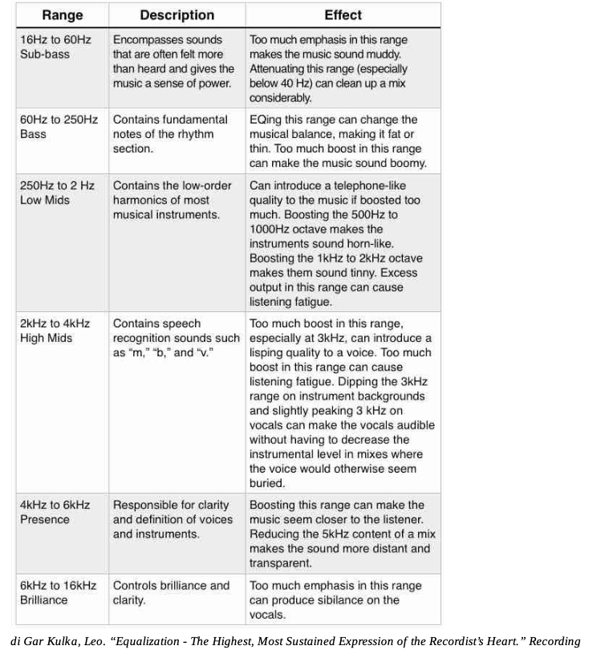
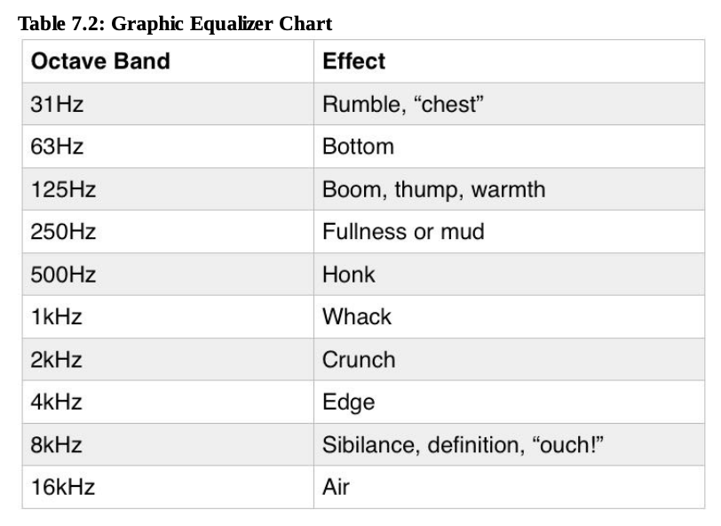
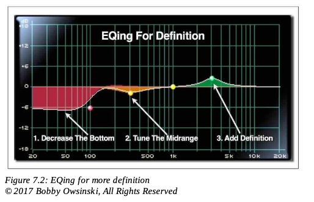
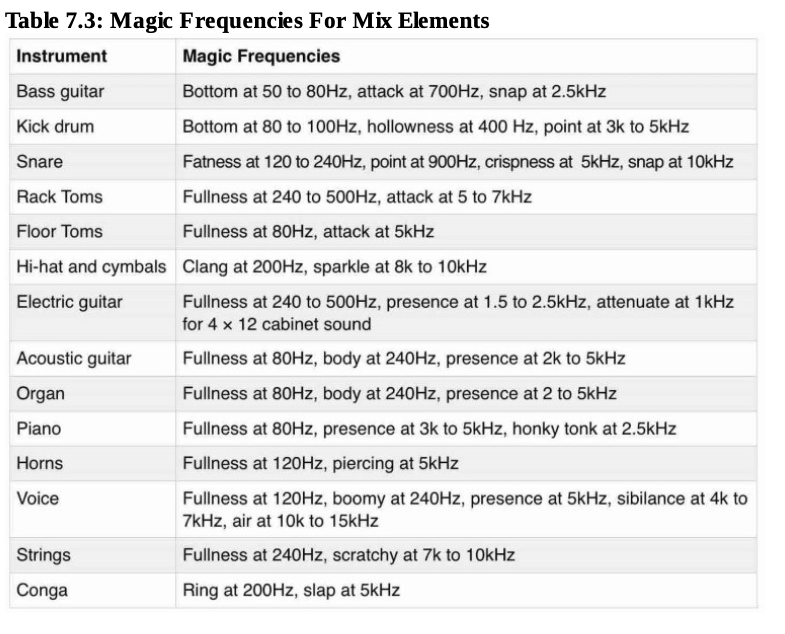

+++
title = "Using EQ"
outputs = ["Reveal"]
[reveal_hugo]
custom_theme = "reveal-hugo/themes/sunblind.css"
margin = 0.2
+++

## The Critical Role of Equalization in Mixing

- The necessity of extending the frequency range during mixing
- Equalizers as the primary tool for achieving sonic enhancements
- The importance of a natural sound and the means to achieve it
- Experienced mixers' approach to EQ usage

{}

- Extending the frequency range of tracks in mixing compensates for limitations from the recording phase, due to various factors like recording environment and instrument sound.
- Equalizers are pivotal in making tracks sound bigger, fatter, brighter, and clearer. Their effective use differentiates skilled mixers from novices.
- Allen Sides emphasizes the goal of achieving a natural sound, regardless of the unconventional methods required, highlighting the significance of a trustworthy reference point.
- Joe Chiccarelli’s statement reflects a minimalist approach to EQ, where less is often more, yet not hesitating to make bold adjustments when necessary.

{}

---

## Objectives of Using Equalization

- Enhancing clarity and definition of instruments
- Amplifying the size and presence of the mix
- Harmonizing the mix by frequency range allocation

{}

- The clarity and definition of an instrument are crucial for its distinctiveness in the mix. Equalization removes muddiness, allowing each note to be heard clearly.
- Equalization can transform a mix, giving it a 'larger than life' quality that exceeds the sum of its parts, adding depth and breadth to the sound.
- Assigning each instrument its predominant frequency range ensures a balanced mix, where every element complements rather than competes with the others. Awareness of these goals allows for more intentional and effective EQ adjustments.

{}

---

---

---

## Fundamental EQ Techniques

- Tailoring EQ approaches to unique song characteristics
- General methods to achieve desired sound qualities
- The importance of careful listening and monitoring levels

{}

- Each song's unique aspects—its arrangement, instruments, and performers—demand a customized approach to equalization, defying one-size-fits-all solutions.
- Familiarizing oneself with various EQ techniques can serve as a foundation, aiding in quickly finding the appropriate sound adjustments for a mix.
- Critical listening at moderate volume levels is essential for discerning subtle sound nuances, ensuring accurate EQ adjustments without being misled by speaker or ear non-linearities.

{}

---

## Equalization for Enhanced Definition

- Addressing lifelessness in well-recorded material through EQ
- Subtractive equalization for removing frequency maskings
- Effective frequency ranges for subtractive EQ
- The principle of minimalistic EQ application

{}

- Overemphasis or severe attenuation of certain frequencies can diminish the vibrancy and clarity of even well-recorded source material, often necessitating EQ adjustments for improved definition.
- Subtractive EQ focuses on eliminating frequencies that obscure an instrument's clarity, particularly effective in the lower midrange (400 to 800Hz) to reduce "boxiness" and in the presence range (3kHz to 6kHz) to enhance definition.
- Two critical frequency ranges for subtractive equalization—200Hz to 600Hz and 2kHz to 4kHz—are often impacted by the proximity effect and microphone presence boosts, respectively. Adjusting these can significantly improve natural sound quality.
- Bruce Swedien's advice underscores the importance of listening before EQing, advocating for a less-is-more approach. Attenuating frequencies rather than boosting them is recommended to avoid undesirable phase shifts and maintain the natural timbre of the instruments.

{}

---

## Method One: Definition 

1. Starting with your EQ flat, remove all the bottom end below 100Hz by turning the low-frequency control to full cut.
2. Using the rest of your EQ, tune the mid-upper midrange until the sound is thick yet distinct.
3. Round it out with a supporting lower-mid tone to give it some body.
4. Slowly bring up the mud-inducing bottom end enough to move air, but not so much as to make the sound muddy.
5. Add some high-frequency EQ for definition (see Figure 7.2).

---

---

## Method Two: Equalize for Size

1. Set the Boost/Cut control to a moderate level of Boost (8 or 10dB should work).
2. Sweep through the frequencies in the bass band until you find the frequency where the sound has the desired amount of fullness.
3. Adjust the amount of Boost to taste. Be aware that too much Boost will make the sound muddy.
4. Go to the frequency either half or twice the frequency that you used in Step 2 and add an amount of that frequency as well. Example: If your frequency in Step 2 was 120Hz, go to 60Hz and add a dB or so as well. If your frequency was 50Hz, go to 100Hz and add a bit there (see Figure 7.3).

---

## Method Three: Juggling frequencies 

- Avoiding solo EQ adjustments to prevent conflicts
- Ensuring each instrument occupies its unique frequency space
- Techniques for balancing the rhythm section and vocals
- Step-by-step process for integrating additional mix elements

{}

- Soloing instruments for EQ adjustments can lead to a mix where elements compete rather than complement each other, due to each being optimized in isolation to sound "bigger and brighter."
- A foundational technique involves starting with the bass and drums, adjusting EQ settings to ensure clarity and distinction between these elements, particularly focusing on not boosting the same frequencies for both.
- When adding vocals and other instruments, the principle of frequency juggling continues: avoid overlapping EQ boosts and consider reciprocal cuts and boosts to maintain each element's distinct space in the mix.
- The gradual integration of each mix element, with continuous comparison and adjustment against the already established mix, ensures a cohesive sound where each instrument is clearly defined and well-integrated, without frequency conflicts.

{}

---

## Golden Rules of EQ for Clarity and Impact

- Cutting at 250Hz for reducing muddiness
- Cutting at 500Hz to eliminate honkiness
- Preference for cutting over boosting to enhance sound quality
- Boosting for distinctive sound alterations
- Limitations on boosting absent frequencies

{}

- To combat a muddy sound in your mix, a reduction around 250Hz can clear up the low-end, providing a cleaner overall sound.
- Addressing honkiness or nasality often involves attenuating frequencies around 500Hz, which can significantly improve midrange clarity.
- A general principle in EQ is to cut frequencies to improve the sound's quality, ensuring a more natural and defined mix without unnecessary coloration.
- Boosting should be reserved for when you aim to alter or emphasize a specific character within the sound, recognizing that EQ cannot introduce elements not originally present in the recording.
- The effectiveness of boosting is inherently limited by the source material; you cannot amplify elements that do not exist in the frequency spectrum of the original audio.

{}

---

## Identifying and Attenuating Problematic Frequencies

- Boosting to identify protruding frequencies
- Sweeping through frequencies to locate issues
- Fine-tuning attenuation for balanced sound

{}

- Initiating the process with a moderate boost helps in making the problematic frequency more perceptible, thus easier to identify within the mix.
- Carefully sweeping through the frequency spectrum allows for the isolation of the specific frequency that is causing discomfort or imbalance in the sound.
- Once identified, the precise adjustment of the cut is crucial to ensure that the problematic frequency is adequately attenuated without adversely affecting the overall sound quality or definition.

{}

---

---

## Key Trouble Frequency Areas in Mixing

- 200Hz: Mud
- 300 to 500Hz: Boxiness
- 800Hz: "Cheap" Sound
- 1k to 1.5kHz: Nasality
- 4kHz to 6kHz: Presence
- 10kHz+: Air

{}

- The 200Hz area is critical for achieving the right balance between fullness and clarity. Excess can lead to a muddy mix, while too little may result in a thin sound.
- Frequencies between 300 and 500Hz are notorious for causing boxiness, particularly noticeable in lower quality microphones and certain drums, often requiring careful reduction.
- The 800Hz range is associated with a cheap, tinny sound reminiscent of low-quality speakers, necessitating careful adjustment to avoid an overly "budget" audio quality.
- Vocal tracks often suffer in the 1k to 1.5kHz range, leading to a nasal sound. Adjusting this range can significantly improve vocal clarity and naturalness.
- The presence range (4kHz to 6kHz) is essential for definition and clarity. Underutilization leads to a dull sound, while overemphasis can cause harshness or sibilance.
- Frequencies above 10kHz add "air" and a sense of space to recordings, enhancing realism and breathiness, especially important in vintage microphone recordings or to simulate such a quality with modern gear.

{}

---

## Balancing Bass and Drums for a Punchy Mix

- Creating space for bass and kick to avoid muddiness
- EQ strategies for kick and bass distinction
- Importance of snare strength and clarity
- Managing low-end clutter for overall mix clarity
- Tuning and level adjustments for optimal mix balance

{}

- The interplay between bass and kick drum is crucial for achieving a mix that sounds big and punchy. Spending time to balance their levels and frequencies ensures the foundation of the song is solid.
- EQ adjustments, such as emphasizing the kick drum in the 60 to 120Hz range and ensuring the bass guitar complements this without frequency overlap, are key steps in avoiding a muddy mix.
- The snare drum's role in driving the rhythm forward cannot be overstated. Proper compression and EQ can enhance its attack, fullness, and snap, ensuring it cuts through the mix effectively.
- Removing unnecessary low-end frequencies from non-bass instruments can dramatically improve the clarity and fullness of the mix, especially in dense arrangements.
- In genres like dance music, the harmonic relationship between the kick and the bass melody is paramount. Ensuring these elements are in tune can prevent dissonance and ensure a cohesive mix.
- Boosting the level rather than the EQ of the bass or kick can often provide the necessary emphasis without overloading the mix with excessive low-end frequencies.

{}

---

## Essential EQ Techniques and Tips

- Adjusting Q values for precision in EQ adjustments
- EQ strategies for mixing placement and texture
- Managing instrument presence in varying mix densities
- The art of subtle EQ enhancements
- Balancing solo and mix contexts for instrument EQ

{}

- Using a narrow Q for cutting helps isolate and remove specific problem frequencies without affecting the surrounding sound, while a wide Q for boosting gently enhances a broader range, ensuring a more natural effect.
- Rolling off the bottom end can help an instrument cut through the mix by reducing muddiness, whereas rolling off the top end can help it blend better by softening its presence.
- In arrangements with fewer instruments, allowing each instrument more sonic space can lead to a fuller, richer sound. Conversely, in dense mixes, scaling back the presence of each instrument is crucial for clarity and cohesion.
- Applying modest EQ boosts at two different frequencies can provide a more balanced enhancement than a significant boost at a single frequency, leading to a more nuanced sound.
- An instrument may sound excellent on its own when EQ'd in isolation, but it's important to ensure that these adjustments still allow it to sit well within the full context of the mix, highlighting the importance of contextual EQ adjustments.

{}

---

## Mixing Techniques for Kick Drums

- Boost at 4kHz and low frequencies, cut 200 to 400Hz
- Use a 32Hz tone triggered with the kick for R&B
- Add clarity to metal kicks with a boost around 3kHz
- For club kicks, focus on 200 to 300Hz and manage low end

{}

- Enhancing a kick drum involves a strategic boost at 4kHz for definition, cutting the muddy frequencies between 200 to 400Hz, and boosting the low end around 60 to 100Hz to find and enhance the drum's natural resonance.
- In R&B music, a unique technique involves triggering a 32Hz tone alongside the kick drum, gating it to match the kick's volume envelope. This is then blended and compressed with the original kick sound for added depth and impact.
- For metal music, adding a slight boost around 3kHz to the kick drum can create a sharp, aggressive edge, often described as the "nail in the paddle" sound, providing clarity and cut through the mix.
- Mixing a kick for club settings requires a focus on the 200 to 300Hz range, while carefully rolling off the extreme low end. This approach takes advantage of club sound systems' capabilities, avoiding overloading them while ensuring the kick punches through.

{}

---

## Optimizing Bass Frequencies for Different Genres

- Balancing low and mid bass frequencies for clarity
- Boosting around 800Hz for definition
- Adjusting frequencies below 200Hz for tone shaping
- Enhancing presence and clarity across the bass spectrum

{}

- For clarity and distinction in the bass, focus on the ratio between low bass (80 to 120Hz) and mid bass (120 to 200Hz) by boosting at 100Hz and cutting or boosting at 150Hz. Adjusting these frequencies can enhance the bass's warmth or definition without compromising its depth.
- Boosting the 800Hz area can add definition to the bass, making it clearer without creating a harsh sound. This frequency range is crucial for bringing out the bass's character without overpowering the mix.
- Utilizing a four-band parametric EQ allows for precise control over the bass's tone. Attenuate frequencies around 40 to 70Hz to clean up the mix, then boost in the 80 to 120Hz range for a solid foundation, and further enhance the 130 to 200Hz range to bring out overtones and the instrument's body resonance.
- To prevent the bass from sounding muddy, focus on boosting frequencies between 60Hz and 1.2kHz where higher harmonics reside. This enhancement will add presence and ensure the bass stands out in the mix. Implementing a low-cut filter at 250Hz can also help in refining the bass's low end, making room for other elements like the kick drum.

{}

---

## Advanced Bass EQ Techniques

- Using EQ to find and enhance the bass's sweet spot
- High-pass filtering to tighten the bass
- Managing low-frequency competition in the mix
- Specialized processing for enhanced definition

{}

- Employ a bell-shaped EQ to boost around 80 to 180Hz, identifying and emphasizing the bass's best frequencies within the track. This technique can significantly improve the bass's fit in the mix, and, if needed, further density can be added by targeting frequencies below this range with another bell filter.
- High-pass filtering the bass between 40 and 80Hz can surprisingly tighten its sound, contributing to a cleaner mix. This simple adjustment can make a significant difference in the overall mix quality.
- Low-frequency content from other instruments can muddy the bass. Cutting below 80 to 120Hz on these tracks ensures that the bass and kick have enough space, improving the mix's clarity and balance.
- To achieve a more defined bass sound, duplicate the bass track and apply specific processing, such as the Moogerfooger Low-Pass plugin, blending this with the original for a fuller sound. This method can also apply to kick drums, providing a more solid foundation for the mix.

{}

---

## Genre-Specific Bass EQ Tips

- Enhancing hip-hop and electronic bass
- Shaping rock bass for aggressive sound

{}

- In hip-hop and electronic music, the bass often plays a critical role with frequencies ranging from 30 to 60Hz. Adjusting the focus to 70 to 100Hz and extending duration can create a fuller bass sound, suitable for playback on systems with smaller monitors without over-EQing.
- For rock genres, achieving an aggressive bass sound involves focusing on the amp's tone. Boosting frequencies between 50 and 100Hz adds bottom end, while cutting between 400 to 800Hz allows more space for guitars and vocals. Boosting between 1.5 and 2.5kHz emphasizes the midrange, ensuring the bass is prominent in the mix.

{}

---

## Enhancing Guitar Tones with EQ

- Boosting midrange for a fuller sound
- Using EQ to highlight specific guitar strings
- Tailoring high frequencies for presence and detail
- Applying filters to define the guitar's space in the mix

{}

- To achieve a thicker guitar sound, boost the midrange by about 9dB and sweep the frequencies to find the balance where the guitar is both full and bright enough to stand out. Once identified, reduce the boost slightly to ensure the guitar remains distinct without overpowering the mix.
- Don Smith's approach to EQ involves using it as a tool to enhance the feel of the instrument in the mix, focusing on balancing individual strings for a more cohesive sound. By boosting frequencies associated with underrepresented strings, such as the A or D string, and sweeping through frequencies, EQ can be used to correct imbalances and integrate the guitar more effectively with other instruments.
- For added clarity and articulation in guitar tracks, boosting at 10kHz emphasizes finger noise and subtle string movements, while a boost between 5 to 8kHz helps the guitar cut through the mix. Elevating frequencies from 1k to 5kHz enhances the guitar's presence, ensuring it captures the listener's attention.
- Implementing high-pass and low-pass filters on guitar tracks can significantly improve mix clarity. Removing excess low end prevents the guitar from clashing with the rhythm section, while cutting frequencies above 8kHz minimizes competition with cymbals, allowing each component of the mix to occupy its own sonic space.

{}

---

## Vocal EQ Techniques for Depth and Clarity

- Boosting lower midrange for a richer tone
- Enhancing clarity with mid to high-mid frequencies
- Adjusting EQ for vocal weight and presence
- Utilizing EQ as an effect to convey emotion

{}

- To give vocals a more profound and "chesty" quality, a slight boost in the 125 to 250Hz range can accentuate the fundamental frequencies of the voice, enriching its tonal depth.
- Focusing on the 2k to 4kHz range sharpens consonant sounds, which can make the vocals feel more intimate and immediate to the listener. This technique is essential for ensuring that the lyrics are intelligible and that the vocal tracks command attention within the mix.
- Ed Seay's perspective on EQ involves using it to sculpt the vocal's weight and texture, adding richness around 300Hz to lend the voice a more significant, authoritative presence when necessary. This approach is akin to adjusting the vocal's "body," either slimming it down or beefing it up, depending on the desired effect.
- Dave Pensado views EQ as a tool for emotional expression, similar to adding chorus or reverb. By subtly boosting frequencies around 3kHz, the vocal can gain an edge or bite that suggests greater effort or passion from the singer, thereby enhancing the emotional resonance of the performance.

{}

---