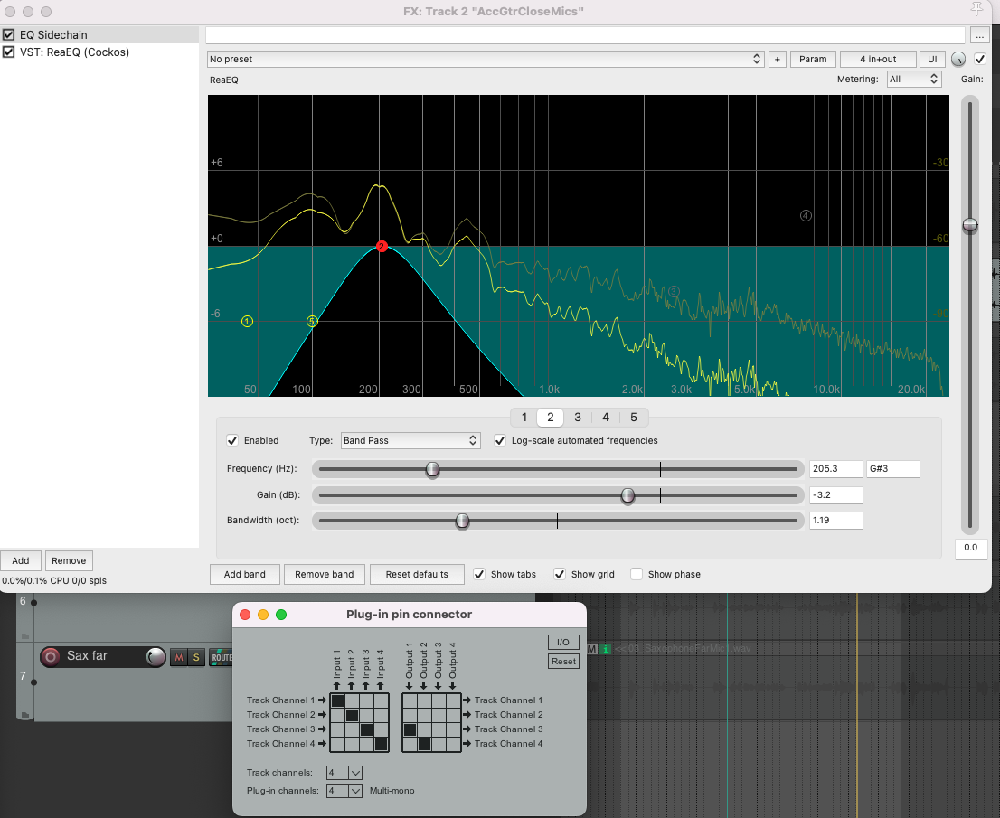
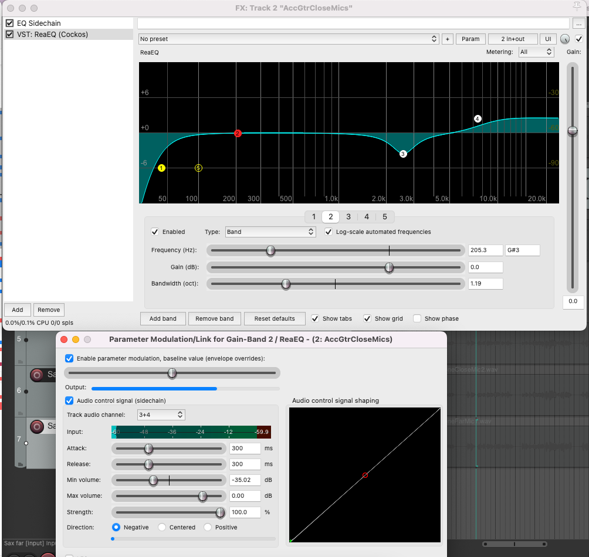

We can use a unique set of tools to fix a dynamics problem that exists in only a certain range of frequencies. This category of tools is called frequency-selective dynamics.

Download the project files [here](https://dakotastateuniversity-my.sharepoint.com/:f:/g/personal/tate_carson_dsu_edu/Er_zD2mebcpHluyYVr11BnkBVjsU9UqNJR9yo_cjWcRNPg?e=GjUEq4).

# FREQUENCY-DOMAIN TWEAKS FOR FULL-BAND DYNAMICS PROCESSORS

Before looking at actual multiband processors, we can do some things by just combining ReaComp and ReaEQ.

## Dynamic EQ with ReqEQ

Given an acoustic guitar recording, some of the notes are muddy while others are not. We can use ReaEQ to fix this. Add ReqEQ and remove all the bands except for one. Set it to be a bandpass filter.

Find the offending frequency with this band. So, instead of removing this frequency for the whole performance, we'll only do it if it's a certain dB level.

Duplicate your EQ and rename the instance to "Sidechain". Move the sidechain EQ first in the path. Then turn off the other EQ.

Change the type to a bandpass filter so now it's cutting everything that isn't the frequency.

We'll now make this into a sidechain. Click on "2 in 2 out". Add two channels and set the output to 3 and 4 from 1 and 2.

Turn the original EQ on. Click the gain setting of this band, so that it's the "last touched". We'll now set this to be modulated by audio input. Click Param. Then click "audio control signal (sidechain)". With the first slider set it so that your EQ curve is flat. Set the "track audio channel" to 3+4. Now we're receiving audio from the other plugin on the same track.

Bring down the "min volume" until you start seeing movement. Switch the direction to "negative" so that it cuts instead of boosts. Adjust this now using the "min volume" along with the "strength" slider.

## DeEssing Vocals with ReaEQ

We de-ess to reduce sibilance or "s" sounds with annoying hissing qualities.

Add a ReaEQ with one band and set it to be a high-shelf filter. Find the range that reduces the sibilance. Duplicate the ReaEQ and rename it "Sidechain". Move the sidechain EQ first in the path. Then turn off the other EQ. Add a high pass filter so that the sidechain EQ is only passing the offending frequency. You can change the shelving filter to a band pass filter to locate the offending frequency event more accurately.

## TDR Nova

Try [TDR Nova](https://www.tokyodawn.net/tdr-nova/) to do the same thing. 

## Mutli-band dynamic EQ

This is a similar process to the previous one, but now we'll change multiple bands at once. Repeat all of the steps from the previous section to remove the "mud" from the kick drum.

Now do the same but with a low shelf filter to reduce some of the lower sub frequencies. Duplicate this band to its own FX, invert it and send its output to 5-6.

You should now have two EQ band moving independently depending on the input.

Add one more band for the top end.

Save this as an FX chain for later use.

## ReaXComp - Multiband compressor

Load ReaXComp and delete one of the bands so that you now have a 3 band multi-band compressor. Notice the meters, the first is RMS, the second is peak. The yellow meter is showing gain reduction on that band only. The blue meter shows makeup gain.

Find a stereo mix of a track on freesound and add a multiband compressor to it.

## ReaFir - background noise

We can do a lot of things Reaper's ReaFir. One good use for ReaFir is background noise reduction. The recordings from the seminar room have the hum of the AC in them. Let's use ReaFir to remove that hum.

Load ReaFir in edit mode precise mode with an FFT size of 1024. Set the mode to "precise". Select a part of the track where it's just AC noise and loop it. Select "automatically build noise profile" then play the track. This builds a profile of the noise to cut it out. You can increase or decrease the gain of this curve by clicking CMD then dragging the mouse. While playing through the track bring up the curve as much as you can without effecting the audio quality.
